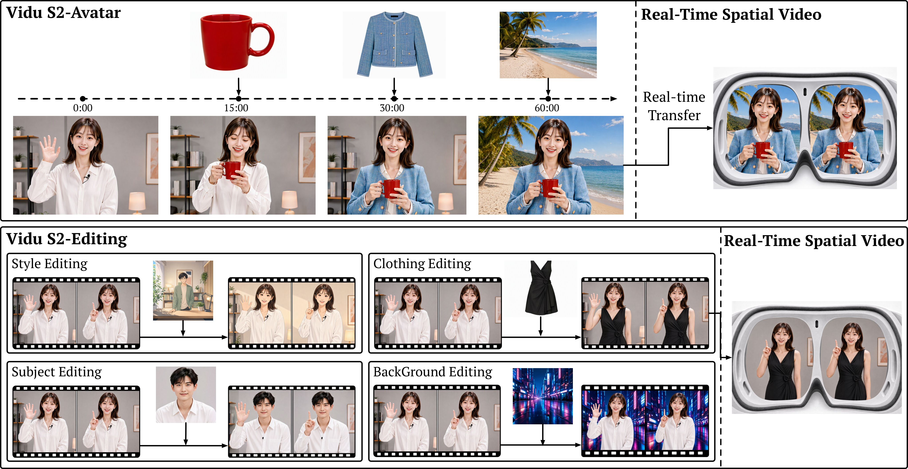

# Vidu S

<div align="center" style="line-height: 1;">
  <a href="https://www.vidu.com/vidu-stream">
    
  </a>
  <a href="https://arxiv.org/abs/2609.11638">
    
  </a>
  <a href="https://arxiv.org/abs/2607.03118">
    
  </a>
  <a href="https://shengshu.feishu.cn/wiki/X7ZLwyLUzi461LkAlNpcTxs1nsy">
    
  </a>
  <a href="https://shengshu.feishu.cn/wiki/Fz8ywkzEwil84LkbCOKcxotMnvb">
    
  </a>
  <a href="https://platform.vidu.com/vidu-stream/doc">
    
  </a>
  <a href="https://platform.vidu.cn/vidu-stream/doc">
    
  </a>
</div>

<p align="center">
  
</p>

## Introduction

### Vidu S2

Vidu S2 extends real-time video generation beyond talking-head digital characters to high-resolution interactive avatars, live video editing, and immersive spatial video. It includes **Vidu S2-Avatar** for controllable character generation and **Vidu S2-Editing** for transforming incoming video streams.

Key breakthroughs:
1. **720p real-time interactive avatars**
   - Vidu S2-Avatar generates 720p video at 25–42 FPS, follows a wider range of instructions—including large body motions such as dancing—and accepts new reference images at any moment during a stream.
2. **Stable long-horizon generation with Self-Replay Forcing**
   - Self-Replay Forcing (SRF) replays re-noised, self-generated trajectories in a gradient-enabled causal pass, helping prevent errors from accumulating across streaming segments.
3. **Real-time editing of incoming video**
   - Vidu S2-Editing supports style transfer, virtual try-on, character replacement, and background replacement from text instructions and optional reference images while preserving the source motion.
4. **Real-time spatial video for immersive displays**
   - Generated or edited streams can be converted into synchronized left- and right-eye views, while stereoscopic inputs can be edited jointly for streaming to VR headsets.
5. **Efficient inference on low-cost GPUs**
   - An optimized serving stack combines TurboDiffusion and TurboServe, using efficient attention, low-bit GEMM, kernel and launch optimizations, and multi-GPU pipelining for real-time inference.

### Vidu S1

Vidu S1 is a real-time interactive video generation model for voice-controlled digital characters. Users can guide generated video content at any moment through spoken instructions, enabling live interaction.  

Key breakthroughs:
1. **Real-time speech control over video content**
   - Users can directly instruct digital characters to perform actions.
2. **Infinite-length real-time interactive generation**
   - Vidu S1 generates 540p video at up to **42 FPS** and can run on consumer GPUs.
3. **Custom character images and voice tones**
   - Vidu S1 supports real people, anime-style characters, pets, and other personalized avatars.

## Quick Links

### Vidu S2

- **Try Vidu S2**: https://www.vidu.com/vidu-stream
- **Vidu S2 Paper**: https://arxiv.org/abs/2609.11638

### Vidu S1

- **Vidu S1 Paper**: https://arxiv.org/abs/2607.03118

## Docs

### English

- **User Guide**: [shengshu.feishu.cn/wiki/X7ZLwyLUzi461LkAlNpcTxs1nsy](https://shengshu.feishu.cn/wiki/X7ZLwyLUzi461LkAlNpcTxs1nsy)
- **API Documentation**: [platform.vidu.com/vidu-stream/doc](https://platform.vidu.com/vidu-stream/doc)
- **Vidu S2-Avatar Quickstart**: [platform.vidu.com/vidu-stream/doc/s2-avatar/realtime/quick-start](https://platform.vidu.com/vidu-stream/doc/s2-avatar/realtime/quick-start)
- **Vidu S2-Editing Quickstart**: [platform.vidu.com/vidu-stream/doc/s2-editing/quick-start](https://platform.vidu.com/vidu-stream/doc/s2-editing/quick-start)

### Chinese

- **User Guide**: [shengshu.feishu.cn/wiki/Fz8ywkzEwil84LkbCOKcxotMnvb](https://shengshu.feishu.cn/wiki/Fz8ywkzEwil84LkbCOKcxotMnvb)
- **API Documentation**: [platform.vidu.cn/vidu-stream/doc](https://platform.vidu.cn/vidu-stream/doc)
- **Vidu S2-Avatar Quickstart**: [platform.vidu.cn/vidu-stream/doc/s2-avatar/realtime/quick-start](https://platform.vidu.cn/vidu-stream/doc/s2-avatar/realtime/quick-start)
- **Vidu S2-Editing Quickstart**: [platform.vidu.cn/vidu-stream/doc/s2-editing/quick-start](https://platform.vidu.cn/vidu-stream/doc/s2-editing/quick-start)

<!--
#### Agent Skill

For agent-assisted API integration, use the `vidu-s1-api` Skill. In Claude Code, Codex, OpenClaw, or any agent that supports Skills, say directly:

```text
Install this skill: https://github.com/shengshu-ai/vidu-s-api/tree/main/skills/vidu-s1-api
```

The agent will clone and install it into the proper Skills directory. Restart the agent if required, then ask it to load `vidu-s1-api` for Vidu S1 API integration.
-->

## Updates

- **[2026-09]**: Vidu S2 is now available to try at [vidu.com/vidu-stream](https://www.vidu.com/vidu-stream)
- **[2026-07]**: Vidu S1 is now available.

## Citation

If you find Vidu S useful for your research, please cite:

```bibtex
@article{zhang2026vidus2,
  title={Vidu S2: Real-Time Interactive, Editable, and Spatial Video Generation},
  author={Zhang, Jintao and Jiang, Kai and Chen, Jintao and Wang, Xu and Liu, Deyuan and Li, Jungang and Chen, Dechuang and Lin, Ming and Zhou, Jingjiang and Jin, Haopeng and others},
  journal={arXiv preprint arXiv:2609.11638},
  year={2026}
}
```

```bibtex
@article{zhang2026vidus1,
  title={Vidu S1: A Real-Time Interactive Video Generation Model},
  author={Zhang, Jintao and Jiang, Kai and Chen, Jintao and Wang, Xu and Luo, Yang and Wang, Yuji and Chen, Dechuang and Li, Jungang and Ye, Chengyang and Chen, Marco and others},
  journal={arXiv preprint arXiv:2607.03118},
  year={2026}
}
```
